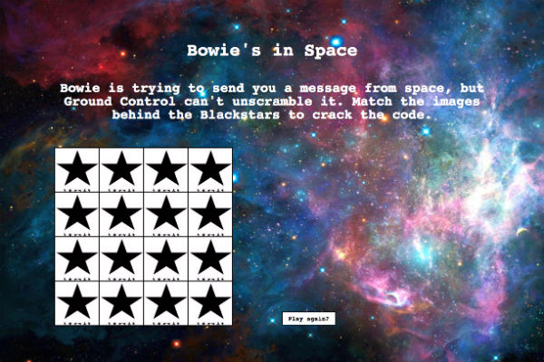
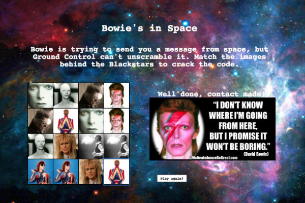

# Bowie's in Space

Bowie's in Space is a simple memory card game. Complete the puzzle to recieve a message from the Starman himself.

The game is built with HTML, CSS and JavaScript.

#####[Play Bowie's in Space](https://bowies-in-space.herokuapp.com/)

###How it works

* On page load a grid of buttons and an array of pairs of images are created.
* When a button is clicked, an image corresponding to the button's data attribute is displayed and both the button and the image are pushed into empty arrays.
* On an odd numbered click a counter is iterated.
* On an even numbered click the two images in this array are compared, if their data attributes are not the same, the images are cleared after one second and the array is emptied ready for the next move. If the data attributes are the same a match has occured and the images remain.
* When all matches have been made an image of a quote from David Bowie is displayed.
* The game can be played again using the reset button.

####Challenges

The major challenge was arranging the images in a random fashion so that each game was different. I solved this by using the Fisher Yates shuffle function. Given more time I would create an array of messages from David Bowie to be chosen from at random, giving a different experience on each play.
